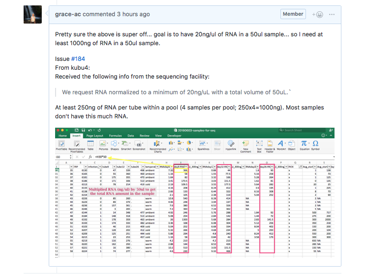

Today I met with Steven to talk briefly about the crab sample pooling (need more info on how to proceed- will wait for Sam's return in 1.5 weeks), and about things I can do in the interim while the samples are being sequenced: practicing Trinity with Geoduck transcriptome data; DecaPod; 2015 Oysterseed project. 

### Crab Pooling

So I misunderstood what was needed. The CORE facility needs at LEAST 20ng/ul of RNA in a 50ul sample. Meaning, the sample needs at 1000ng of RNA. However, when the Qubit results (in ng/ul) are multiplied by 50ul (the final volume of the isoated RNA samples), the vast majority of them are well below 250 ng of RNA. For a pool (4 crab samples per pool) to be successful, each sample needs to contribute at least 250ng of RNA to the pooled sample. 

Here's link to GitHub issue: [here](https://github.com/RobertsLab/resources/issues/285)

My epiphany notes from today:    

### Practicing with Trinity

Steven mentioned that while the samples are being sequenced (it can take about 1.5 months) it would be cool if I practiced/ learn how to use Trinity on some Geoduck transcriptome data. I will be using Trinity to assemble the transcriptome from my samples later.

Here is a link to a wiki on Trinity that I have been reading about: [here](https://github.com/trinityrnaseq/trinityrnaseq/wiki)

### DecaPod

When I was in Juneau last November with Pam, I met Genevieve Johnson who is a current intern at NOAA and she is working on Tanner crab hybrid population structure and genomics. I met up with her again this past weekend when I was in Juneau visiting my sister and we spoke more about our projects. She is in Seattle this week and if she has time, I will meet up with her and record a little about what she's up to and her experience with Tanner crabs for a new episode of DecaPod.

If she doesn't have time while she's here, we can try and do it remotely. Should be interesting to see how the sound quality works with that.

Some other episode ideas are:   
- Crab pooling plan and sequencing info (wait for Sam to get back to get better idea of what is involved)
- Some summaries of literature on Tanner crabs and Bitter crab disease and Hematodinium that I read

### 2015 Oysterseed project

Work on understanding what I'm doing and making sure I choosing the rights settings because my peaks are looking pretty bad. I had a really high error rate last week, so I need to go through the protocols and Yaamini and Laura's notebooks to see what they did.

