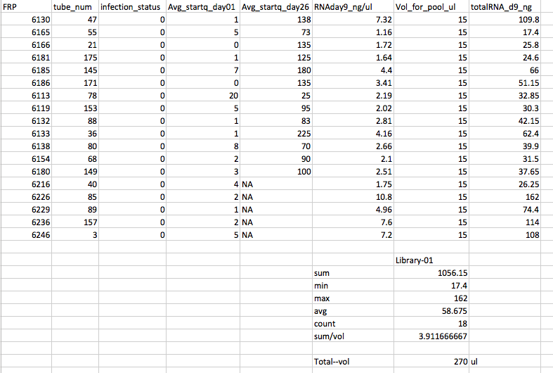
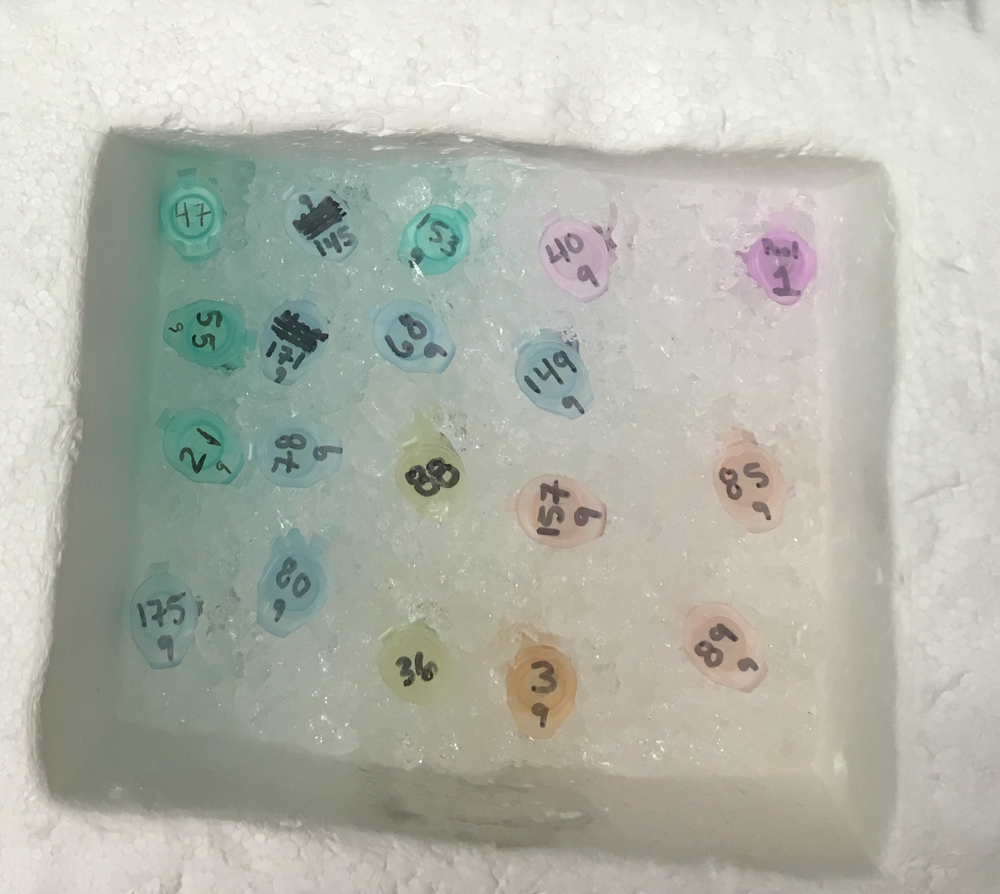
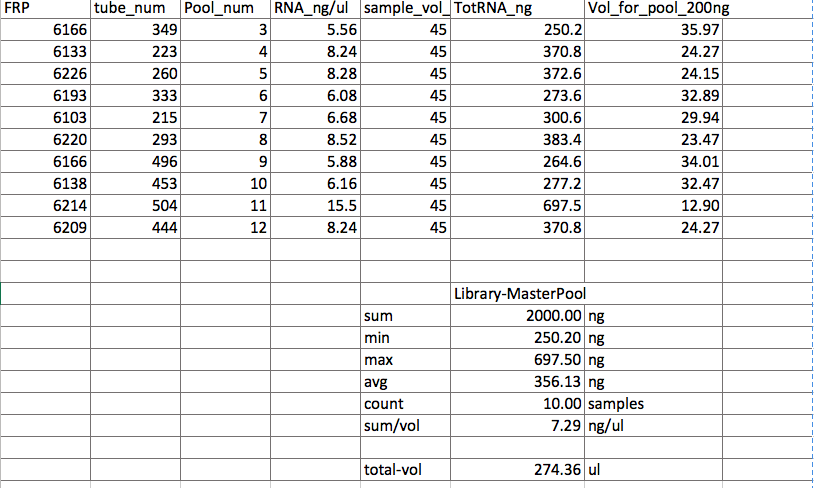
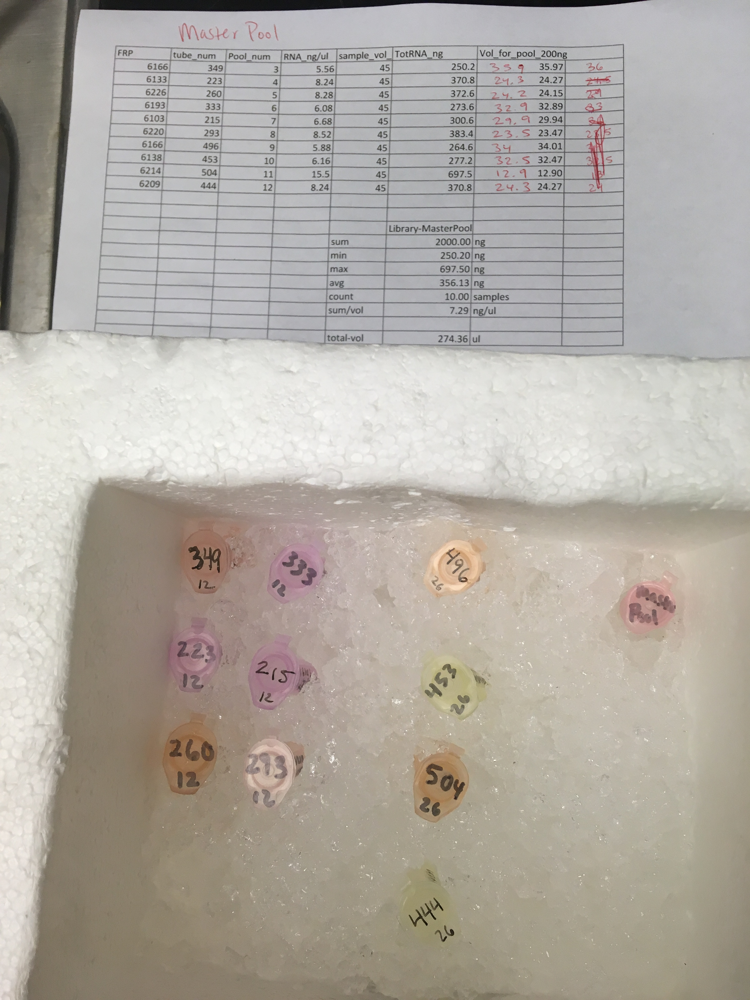

This post is a summation of what I did this week. I made the 3 pools for RNASeq (speed vac will happen Tuesday when both Sam and I are in), and am starting to create an ultimate master crab spreadsheet with ALL the data that we have on this project. 

### Sample Pools for RNASeq

Made 3 pools as detailed in [July 2nd's post](https://grace-ac.github.io/Pool-scheme-for-Thurs/).

Pools 1 and 2 were made by thawing all the tubes on ice. Vortex each tube 5s. Pipette out 15uL into a 1.7ml snap cap tube. These two pools have equal volume from each sample, but not equal RNA from each sample contributing to the pool.

The third pool, "MasterPool" as it is preliminarily called, was made by calculating how many ul of sample should be put into the pool such that each sample contributed 200ng of RNA to the pool. The pool was created in the same way as pools 1 and 2, except there were different volumes from each of the ten samples.

Pool #1              

Pool #2         

MasterPool

You may notice that the tube numbers are different from my post from July 2nd. That is because on that day, I accidentally grabbed the tube numbers from the RNAday12 columne instead of the RNAday26. Pam brought this to my attention and I revised and reviewed numerous times. Also, I rounded the pipette volumes to the nearest 0.1 ul. 

### ULTIMATE master crab spreadsheet
Work in progress master csv: [20180713-crab-master-true.csv](https://github.com/grace-ac/crab-sample-selection/blob/master/20180713-crab-master-true.csv)          
I added some R script to the Rproj [script](https://github.com/grace-ac/crab-sample-selection/blob/master/scripts/sample-selection.R) to begin the process of creating a crab master spreadsheet with alllll the data we have. It is getting weird because there are a lot of repeat columns, so I will pull out the extra repeats. Also, I need to figure out how to add FRP codes to the crab data in the [20180125-Crab-Collection-DATA_DNA-plates.xlsx](https://github.com/RobertsLab/project-crab/blob/master/data/20180125-Crab-Collection-DATA_DNA-plates.xlsx). There are only tag numbers lsted. I'm thinking this can be done in R by cross-referencing other spreadsheets where the tags numbers and FRPs are listed.
